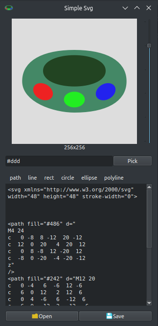

# Simple Svg
A simple Qt app to edit `.svg` files.

Download [Appimage](https://github.com/slidinghotdog/simple-svg/releases/download/0.1/Simple_Svg-x86_64.AppImage).

 

### Install from source:

- #### Install dependencies:
Debian/Ubuntu: `sudo apt install -y git build-essential qt5-default libqt5svg5-dev`

- #### Clone repo and run install script:
```
git clone https://github.com/slidinghotdog/simple-svg.git
cd simple-svg
./install.sh
```
